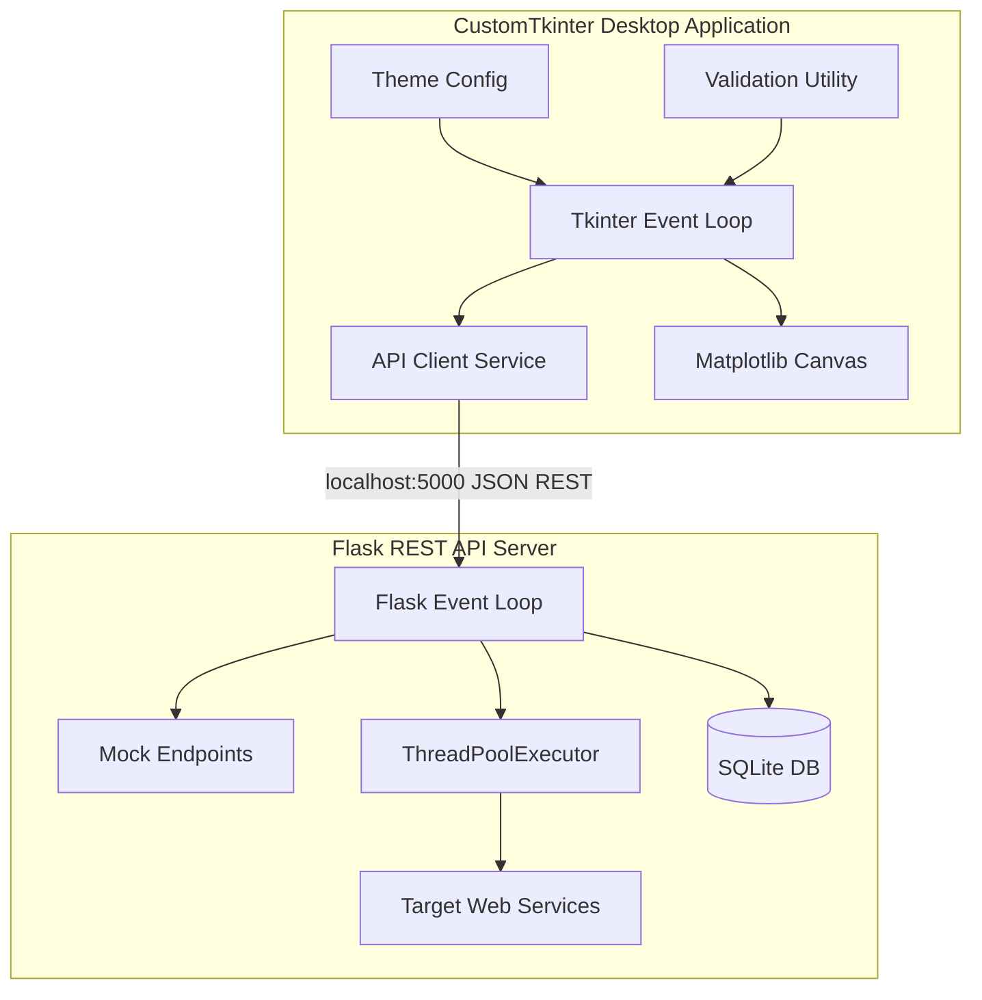

# API Load Testing Dashboard
> **University Semester Project**  
> **Course:** Software Construction & Development (4th Semester)  
> **Aesthetic Desktop client powered by CustomTkinter, Matplotlib, Flask, and SQLite**

---

## 📖 Project Overview

The **API Load Testing Dashboard** is a multi-process Client-Server desktop application designed for developers to run stress tests and analyze HTTP endpoint performance. The application features a sidebar-driven interface containing five pages: a welcome dashboard with system health monitors, an input form with real-time logs and progress bars, an interactive Matplotlib charting interface, an SQLite history explorer, and configuration options.



---

## 🛠️ Technology Stack
*   **Frontend UI:** Python CustomTkinter (with custom Dark/Light theme binding).
*   **Data Visualization:** Matplotlib (utilizing TkAgg backend and dynamic dark theme configuration).
*   **Backend Core:** Python Flask REST API (multithreaded controller, mock servers).
*   **Database Engine:** SQLite (structured summaries and request latency detail logging).
*   **Unit Testing Framework:** PyTest.

---

## 🚀 Installation & Quick Start

### Prerequisites
Make sure Python 3.10+ is installed on your Windows system.

### 1. Clone & Install Dependencies
Navigate to the root workspace and run:
```bash
python -m pip install -r requirements.txt
```

### 2. Run the Integrated System
Run the unified launcher script:
```bash
python main.py
```
This launcher:
1. Spawns the Flask backend server in a background daemon subprocess (`http://127.0.0.1:5000`).
2. Staggers execution for 2 seconds to let the server bind to the port.
3. Launches the CustomTkinter GUI client.
4. Cleanly terminates the Flask daemon process on window closure.

### 3. Running Unit Tests
Execute the pytest suite (15 tests covering database schemas, validations, and server route handlers):
```bash
python -m pytest backend/tests/
```

---

## 📘 Software Engineering Requirements (SCD Course)

### 1. Agile Process Model
This project was constructed following **Agile Scrum Methodologies** partitioned into short sprints:
```
[Requirements] ➔ [Backlog Planning] ➔ [Sprints (GUI/REST/DB)] ➔ [Verification & Testing] ➔ [Review]
```
1.  **Requirements Gathering:** Identified the need for asynchronous load testing, mock endpoints, and SQLite state persistence.
2.  **Sprint Planning:** Prioritized tasks (Core utilities -> DB Schema -> Flask controllers -> Tkinter frames -> Matplotlib integrations).
3.  **Sprints & Daily Scrums:** Developed components incrementally, preventing GUI thread blocking by isolating concurrent requests on the backend.
4.  **Sprint Review & Testing:** Utilized `pytest` for validation and API routes.

### 2. Software Process Improvement (SPI)
SPI practices were applied to enhance code maintainability and reliability:
*   **Thread Isolation:** Separated UI painting thread from concurrent HTTP execution. Network request workers run in a backend thread pool (`ThreadPoolExecutor`), while the UI uses a polling client loop (`root.after()`).
*   **Database Transaction Safety:** Used atomic transaction commits (`conn.commit()`) and rollbacks (`conn.rollback()`) to guarantee data integrity across test details.
*   **Input Cleansing:** Validated domains, integer restrictions, and JSON syntaxes client-side before dispatching network calls, minimizing server-side error states.

### 3. Version Control (Git Workflows)
To maintain code quality in shared repositories, follow these Git command templates:
*   **Initialize Repository:**
    ```bash
    git init
    git add .
    git commit -m "feat: initial commit of load testing core structure"
    ```
*   **Branch Management (Feature Branching):**
    ```bash
    git checkout -b feature/analytics-matplotlib
    # (Write code changes...)
    git add .
    git commit -m "feat: embed 2x2 matplotlib charts inside analytics page"
    git push origin feature/analytics-matplotlib
    ```
*   **Pull Requests (PR):** Open a PR on GitHub to merge `feature/analytics-matplotlib` into `main`, running the automated PyTest suite before merging.

### 4. Lehman's Law Justification
This application directly adheres to **Lehman's Law of Continuing Change**:
> "An E-type system must undergo continual change (adaptation) or it becomes progressively less useful."
*   **Justification:** Web APIs continuously evolve (adding OAuth2, OAuth Bearer tokens, Websockets, and API proxies). To keep this dashboard useful, the codebase is structured modularly so future developers can easily add user authentication, AI-based performance prediction algorithms, or custom PDF reporting without rewriting the core UI logic.

### 5. Peer Reviews
We conducted formal inspection walkthroughs to verify structural quality:
*   **Code Review Log:**
    *   *Issue Identified:* Directly calling HTTP requests from CustomTkinter event listeners froze the UI thread.
    *   *Resolution:* Shifted execution to the Flask server in an asynchronous thread worker, using a polling REST client on the Tkinter side.
    *   *Inspectors:* Group Team Members.

### 6. Deployment Guide
*   **Local Host:** Launch utilizing `python main.py` or separate services (`python backend/app.py` in terminal A, `python frontend/main.py` in terminal B).
*   **Render / Railway Deployment:**
    *   Create a Render Web Service linked to the repository.
    *   Build Command: `pip install -r requirements.txt`
    *   Start Command: `python -m gunicorn backend.app:app` (ensure gunicorn is added to dependencies).
    *   Since SQLite is ephemeral on Render, use a persistent disk mount or replace SQLite connection string with PostgreSQL in `backend/database/db.py`.
